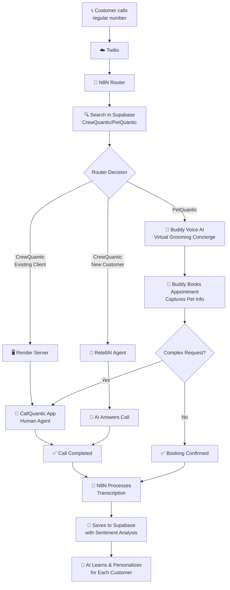

# 📞 CallQuantic - Smart Call Routing Addon

## 🎯 Overview

CallQuantic is a React Native mobile app addon for **CrewQuantic** and **PetQuantic** platforms. It intelligently routes phone calls with automatic transcription and AI personalization, serving as a critical communication layer for service businesses.

**Status:** Currently in TestFlight beta, serving service businesses in Massachusetts and Florida.

---

## 🏗️ Architecture

### Components

| Component | Purpose |
|-----------|---------|
| **Twilio** | Manages phone calls and routing |
| **N8N** | Routes calls and processes data |
| **Render** | Generates security tokens for existing clients |
| **Supabase** | Database (CrewQuantic, PetQuantic, etc) |
| **RetellAI** | AI agent for new customers |
| **CallQuantic App** | Mobile app (iOS/Android) for human agents |

---

## 🔄 How It Works

### System Flow



---

## 🐾 PetQuantic Integration: Buddy Voice AI

### What is Buddy?

**Buddy** is the Virtual Grooming Concierge for PetQuantic. It's an AI-powered voice assistant that handles customer calls 24/7, providing seamless appointment booking and customer service.

### Key Features

#### ✨ Real-time Voice AI Demo
- **Test with sample calls** - Experience Buddy in action
- **See real-time transcription** - Watch conversations unfold live
- **Sentiment analysis** - Understand customer emotions during calls

#### 🎯 How We Know Your Customers
- **Smart conversation flow** designed specifically for pet parents
- **Automatic pet and owner information capture** - No manual data entry needed
- **Integrated booking system** - Seamlessly connects with PetQuantic platform

#### 📞 How It Works (Full Version)
1. **Customers call your regular number** - No special numbers needed
2. **Calls forward to Buddy automatically** - No staff needed for basic bookings
3. **Complex requests can transfer to team** - Human staff available via CallQuantic app
4. **All conversations are transcribed** - Every interaction is saved and analyzed

#### 🤖 What Buddy Can Do
- ✅ **Book grooming appointments 24/7** - Never miss a booking opportunity
- ✅ **Answer service questions instantly** - Immediate responses to common inquiries
- ✅ **Remember your pet's preferences** - Personalized service for each pet
- ✅ **Send appointment confirmations** - Automated follow-up communications

#### 📊 Live Metrics & Analytics
- **Real-time transcript** - See conversations as they happen
- **Customer sentiment** - Track positive, neutral, and negative interactions
- **Call duration & metrics** - Monitor performance and efficiency
- **Mock booking data** - Test and demonstrate capabilities

#### 🚀 Coming Soon
- 📱 Phone number integration
- 💬 SMS confirmations
- 📅 Calendar sync
- 👥 Customer database

---

## 🛠️ CrewQuantic Integration

### Routing Logic

#### Existing Clients (Registered Users)
1. Customer calls → Twilio receives call
2. N8N searches user in Supabase
3. If user is existing client (registered + callquantic) → Render generates security token
4. CallQuantic app receives notification
5. Human agent answers via mobile app

#### New Customers
1. Customer calls → Twilio receives call
2. N8N searches user in Supabase
3. If user is new customer (not registered) → RetellAI agent answers automatically
4. AI handles the conversation
5. Call is transcribed and saved

---

## 📱 Technical Stack

### Frontend
- **React Native** - Cross-platform mobile development
- **Expo** - Development framework and tooling
- **TypeScript** - Type-safe development

### Backend & Services
- **Twilio Voice SDK** - Phone call management
- **Supabase** - Database and backend services
- **N8N** - Workflow automation and routing
- **Retell AI** - AI voice agent
- **Push Notifications** - Real-time alerts

### Infrastructure
- **Render** - Token generation server
- **Supabase Postgres** - Primary database

---

## 🔐 Security & Access

### TestFlight Beta
Currently available through Apple TestFlight. To request access:

**Email:** hello@flowquantic.ai  
**Subject:** CallQuantic TestFlight Access Request

### Repository Status
🔒 **Private Repository** - Source code is not publicly available

---

## 📈 Key Benefits

### For Service Businesses
- ✅ **24/7 availability** - Never miss a call
- ✅ **Automatic routing** - Smart call distribution
- ✅ **AI personalization** - Each customer gets tailored service
- ✅ **Complete transcription** - All conversations saved for analysis
- ✅ **Sentiment tracking** - Understand customer satisfaction
- ✅ **Multi-product support** - One app for CrewQuantic and PetQuantic

### For Customers
- ✅ **Instant responses** - No waiting on hold
- ✅ **24/7 booking** - Schedule appointments anytime
- ✅ **Personalized service** - AI remembers preferences
- ✅ **Seamless experience** - Natural conversation flow

---

## 🔄 Call Processing Flow

### Step-by-Step Process

1. **Customer Initiates Call**
   - Dials regular business number
   - Call routed through Twilio

2. **System Identifies User**
   - N8N searches Supabase database
   - Checks user type (existing client, new customer, PetQuantic customer)

3. **Intelligent Routing**
   - **CrewQuantic Existing Client** → Render generates token → App receives call
   - **CrewQuantic New Customer** → RetellAI answers automatically
   - **PetQuantic** → Buddy Voice AI handles the call

4. **Call Handling**
   - Human agents answer via CallQuantic app (existing clients/complex requests)
   - AI agents handle routine inquiries automatically
   - Buddy books appointments and captures information

5. **Post-Call Processing**
   - Call is automatically recorded
   - N8N transcribes audio to text
   - Transcription saved to Supabase with sentiment analysis
   - AI learns from each interaction for future personalization

---

## 📊 Data Flow

### Transcription & Learning Pipeline

```
Call → Recording → N8N Processing → Transcription → 
Sentiment Analysis → Supabase Storage → AI Training → 
Personalized Future Interactions
```

### Information Captured

- **Pet Information** (PetQuantic)
  - Pet name, breed, age
  - Grooming preferences
  - Service history

- **Owner Information**
  - Contact details
  - Booking preferences
  - Communication history

- **Call Metrics**
  - Duration
  - Sentiment scores
  - Interruptions
  - Turn count

---

## 🎯 Use Cases

### PetQuantic Scenario
**Customer calls to book grooming appointment:**
1. Call routed to Buddy
2. Buddy greets customer naturally
3. Captures pet and owner information
4. Books appointment in PetQuantic system
5. Sends confirmation
6. If complex request → Transfers to human staff via app

### CrewQuantic Scenario (Existing Client)
**Existing client calls:**
1. System identifies existing client status
2. Render generates secure token
3. CallQuantic app receives notification
4. Human agent answers via mobile app
5. Call handled with personal attention

### CrewQuantic Scenario (New Customer)
**New customer calls:**
1. System identifies new customer status
2. RetellAI agent answers automatically
3. AI handles inquiry or routes appropriately
4. Call transcribed for future learning

---

## 🚀 Future Enhancements

### Planned Features
- 📱 **Phone number integration** - Direct number assignment
- 💬 **SMS confirmations** - Automated text message confirmations
- 📅 **Calendar sync** - Integration with business calendars
- 👥 **Enhanced customer database** - Richer customer profiles
- 🔄 **Multi-language support** - Serve diverse customer base
- 📊 **Advanced analytics** - Deeper insights into call patterns

---

## 📞 Contact & Access

### Request TestFlight Access
**Email:** hello@flowquantic.ai  
**Subject:** CallQuantic TestFlight Access Request

### Current Availability
- ✅ Massachusetts service businesses
- ✅ Florida service businesses
- 🔄 Expanding to additional markets

---

## 📝 Technical Details

### API Endpoints
- **N8N:** `tbardini.app.n8n.cloud`
- **Render:** `callquantic-token-server.onrender.com`
- **Supabase:** `znmnexoltfkexdeiwlip.supabase.co`

### Development
- **Platform:** iOS & Android
- **Framework:** React Native with Expo
- **Language:** TypeScript
- **State Management:** Redux Toolkit
- **Backend:** Supabase (PostgreSQL)

---

## 🎓 How to Test

### For Developers
1. Request TestFlight access via email
2. Install app on iOS device
3. Test call routing scenarios
4. Monitor real-time transcriptions
5. Review sentiment analysis

### For Business Owners
1. Contact for demo access
2. Experience Buddy Voice AI
3. See real-time booking flow
4. Review transcription quality
5. Understand personalization features

---

## 📚 Related Projects

- **PetQuantic** - All-in-one platform for pet groomers and daycares
- **CrewQuantic** - Smart dashboard for landscaping and field service teams
- **FlowQuantic** - AI platform for service businesses

---

## 📅 Last Updated

**Date:** 2025-01-14  
**Version:** TestFlight Beta  
**Status:** Active Development

---

## 🔗 Links

- **TestFlight Access:** Request via hello@flowquantic.ai
- **PetQuantic:** https://petquantic.com
- **CrewQuantic:** https://www.crewquantic.com

---

**Powered by FlowQuantic** 🚀

